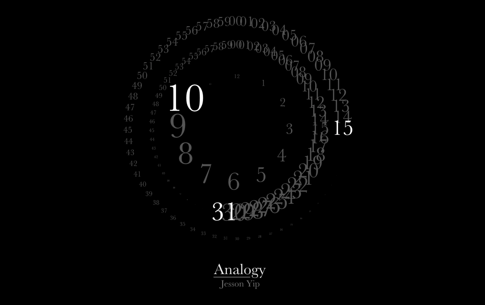

# Analogy

A Web Version of the beautiful Analogy Clock from Jesson Yip (originated from http://www.jessonyip.com/)

### Information

This is an adaption of the Analogy Clock for running in web browsers. Press 'i' to invert colors from black to white.

### Platform

This version is built to run on a Raspberry Pi, therefore a conversion from SWF to JS (Google Swiffy) was necessary due to performance issues. The original version (using flash) might be available later.

### Progress

ToDo:

- Nothing open yet

Done:

- [x] Option to invert colors
- [x] Fix centering layout for 100%
- [x] Port SWF to JS using Google Swiffy
- [x] Optimize animations (easeOutBack instead of easeOutElastic)
- [x] Center Jesson Yip Logo
- [x] Invert Colors (Black Version)