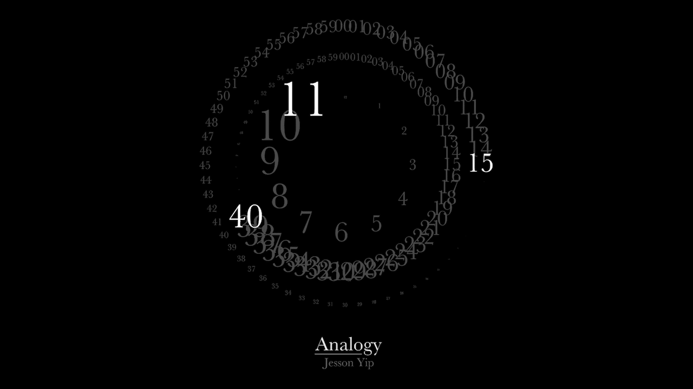

# Analogy

A Web Version of the beautiful Analogy Clock from Jesson Yip. Find a live version [here](https://rafaelmaeuer.de/clock/analogy).

### Information

This is an adaption of the Analogy Clock to run in web browsers. Press `i` to invert colors from black to white.

### Platform

This version is built to run on a Raspberry Pi, therefore a conversion from SWF to JS (Google Swiffy) was necessary due to performance issues. The original version (using flash) might be available later.

### Improvements

- [x] Add option for inverse colors
- [x] Fix centering layout for 100%
- [x] Port SWF to JS using Google Swiffy
- [x] Optimize animations (`easeOutBack` instead of `easeOutElastic`)
- [x] Center Jesson Yip Logo
- [x] Invert Colors (Black Version)

### Credits

Original taken from [jessonyip.com](https://jessonyip.com/)